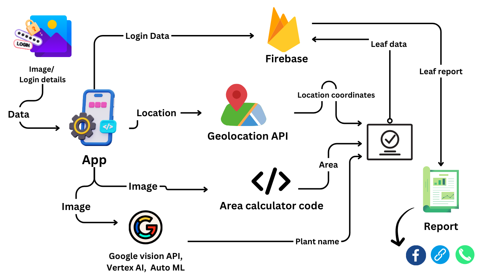
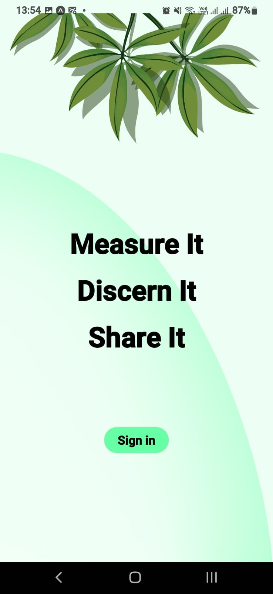
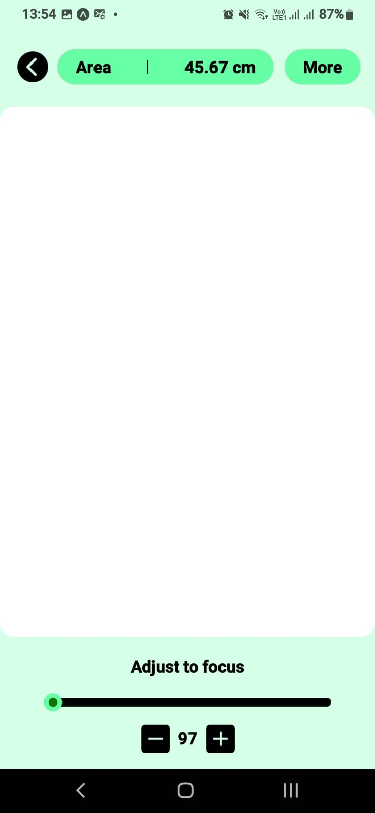
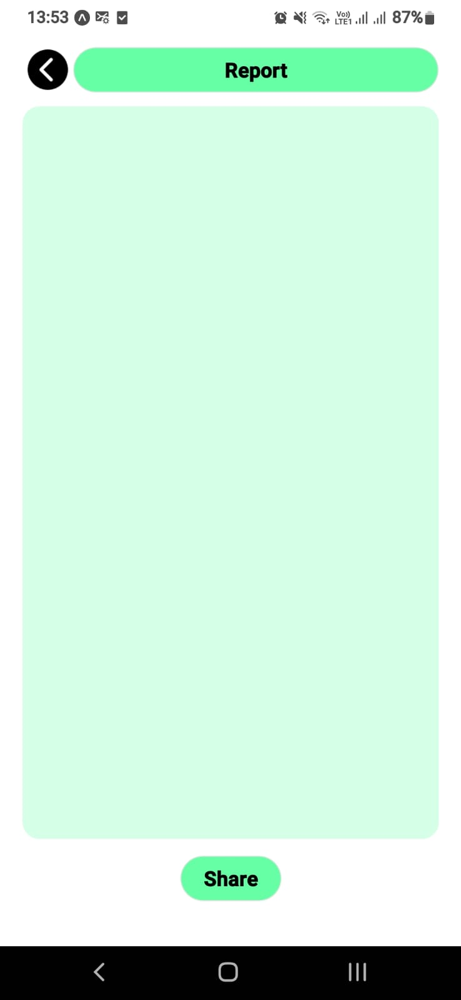

[comment]: # "This is the standard layout for the project, but you can clean this and use your own template"

# Mobile app to measure the area of a leaf, flower or fruit

---

<!-- 
This is a sample image, to show how to add images to your page. To learn more options, please refer [this](https://projects.ce.pdn.ac.lk/docs/faq/how-to-add-an-image/)

 -->

## Team
-  E/19/006 ,ABREW S.T.D., [email](e19006@eng.pdn.ac.lk)
-  E/19/034 ,BAMBARAGAMA H.M.K.D., [email](e19034@eng.pdn.ac.lk)
-  E/19/226 ,MADHUSHANKA K.G.M., [email](e19226@eng.pdn.ac.lk)
-  E/19/432 ,WICKRAMAARACHCHI U.I., [email](e19432@eng.pdn.ac.lk)

## Table of Contents

1. [Introduction](#introduction)
3. [Links](#links)
4. [Data and Control Flow](#Data-and-Control-Flow)
5. [App UI](#App-UI)

---

## Introduction

The crop department of agriculture faculty is expecting to use a mobile app to measure the area of a leaf, flower or fruit. Through advanced image analysis algorithms, AgroCam precisely calculates areas, catering to the irregular shapes often found in nature. Our user-friendly interface guides you through the process, making it accessible even to those new to digital measurement techniques.

---

## Objective

The principal goal is to develop a mobile application designed to facilitate the calculation of leaf surface area. This application aims to provide a valuable tool for researchers, students, and farmers, streamlining their tasks and enhancing their ability to measure and analyze leaves more efficiently.

---

## Data and Control Flow 

---

## App UI

1. Sign-in Screen

2. Home page /  Camera screen

3. Adjust the focus screen  

4. Report screen

## Links

- [Project Repository](https://github.com/cepdnaclk/e19-co227-Mobile-app-to-measure-the-area-of-a-leaf-flower-or-fruit)
- [Project Page](https://cepdnaclk.github.io/e19-co227-Mobile-app-to-measure-the-area-of-a-leaf-flower-or-fruit)
- [Department of Computer Engineering](http://www.ce.pdn.ac.lk/)
- [University of Peradeniya](https://eng.pdn.ac.lk/)

[//]: # (Please refer this to learn more about Markdown syntax)
[//]: # (https://github.com/adam-p/markdown-here/wiki/Markdown-Cheatsheet)

